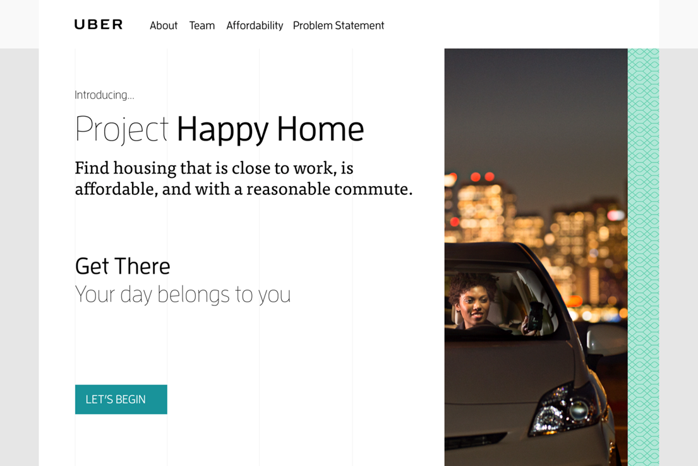

# HappyHomes

Welcome to Happy homes!!! Our site helps users determine the best place to live through how much it will cost them to commute to work.

## Details
Serving last-mile mobility

Public transit and other services provide numerous mobility options for citizens. However, it can be difficult to obtain convenient, affordable and safe access to these services in underserved areas. Using the Uber Developer Platform, develop compelling applications with easy-to-use features, services, and tools that can help bridge that gap. Incorporate non-transportation information, like public safety (crime) and access to quality schools.

## Background

Janice doesn’t own a car, and she’s determined to keep her transportation budget reasonable. She wants to move out of the city to an opportunity area with low crime and high-performing schools, but also needs to keep her commute time as low as possible.
Challenge: Build a tool that helps Janice balance her transportation costs and time spent commuting, focusing on affordable housing in opportunity areas.

## Bios
See contributor details on site

## Datasets and API's
- Google Directions / Geocode API
- Uber SDK
- Pad Mapper
- AARP Livability Index
